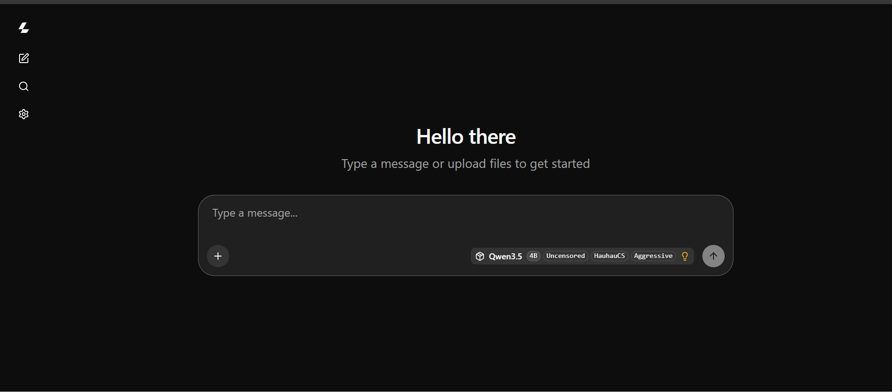

# ToolPort

<p align="center">
  Turn a Colab GPU into a tool-enabled LLM endpoint.
</p>

<p align="center">
  Run long-context GGUF models with <code>llama.cpp</code>, expose an OpenAI-compatible API, and connect browser tools through MCP.
</p>

<p align="center">
  
</p>

---

## What is ToolPort?

**ToolPort** is a lightweight setup for running LLMs on **Google Colab** with:

- **llama.cpp**
- **OpenAI-compatible API**
- **long context support**
- **Cloudflare public URL**
- **MCP integration**
- **real browser automation with Playwright**

It gives you a simple way to turn a Colab runtime into a usable AI endpoint with tools.

---

## Highlights

- Run **GGUF models** on Colab
- OpenAI-compatible `/v1` API
- Automatic active-port detection
- Public HTTPS access with Cloudflare
- MCP support for tool use
- Browser control via **Microsoft Playwright**
- Simple Windows launcher for local MCP bridge

---

## Project Structure

```text
ToolPort/
├── toolport_colab_qwen3_5_4b.ipynb
├── START_TOOLPORT_MCP.bat
├── toolport_bootstrap.js
├── toolport_mcp_https_bridge.js
├── toolport-playwright-mcp.config.json
├── TOOLPORT_MCP_SETUP.md
└── README.md
